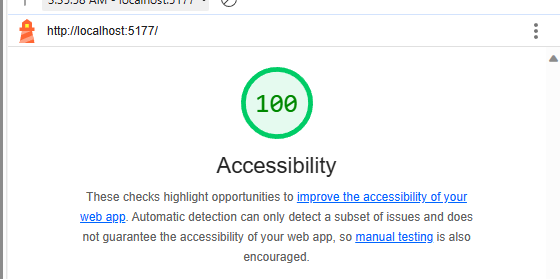
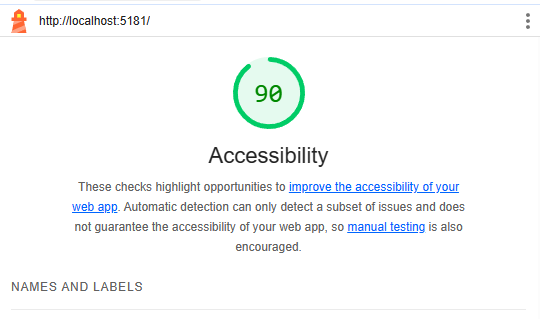

# React + Vite
Lab 01 thru Lab 04:

## Gallaery of Horns
### Author: Brett Fort

---

## Lab#2 
- Number and name of feature: Feature #1: Display Images
- Estimate of time needed to complete: 2hrs
- Start time: 1500
- Finish time: 1700
- Actual time needed to complete: 2hrs

- Number and name of feature: Feature #2: Allow Users to Favorite Individual Beasts
- Estimate of time needed to complete: 1 hr
- Start time: 1730
- Finish time: 2000
- Actual time needed to complete: 2hrs

- Number and name of feature: Feature 3: Bootstrap
- Estimate of time needed to complete: 2hrs
- Start time: 1500
- Finish time: 2000
- Actual time needed to complete: 5hrs. Did this will trying to get the other two features working. 

### Bug fixes for this Lab:
1. ~~Need to get the Rows and Columns to work~~
1. ~~Add the heart feature.~~ 
*Fixed*
- Actual time needed for fixes: 3hrs.
---

### Lab#3
#### Lighthouse Score:

- Number and name of feature: Display a Modal
- Estimate of time needed to complete: 2 hrs
- Start time: 1700
- Finish time: 2200
- Actual time needed to complete:  5hrs

---

### Lab#3
#### Lighthouse Score:

- Number and name of feature: Feature 1. Filter by Numbers of Horns
- Estimate of time needed to complete: 5 hrs
- Start time: 1700
- Finish time: 2200
- Actual time needed to complete:  5hrs

---

## Steps need to be completed.
1. Deploy site to GitHub